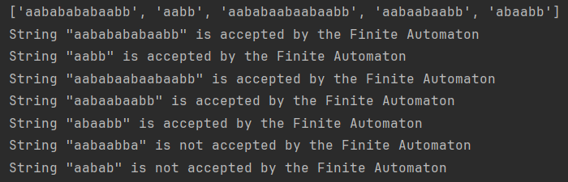

# Laboratory Work 1: Regular Grammars

### Course: Formal Languages & Finite Automata
### Author: Mihalachi Mihail 

----

## Theory
A formal language is a precisely defined set of strings over a finite alphabet, along with rules or grammar that specify which strings are considered valid in that language.
The components of a formal language include:
* Alphabet: The set of symbols or characters that form the basic building blocks of strings in the language.
* The vocabulary: A finite sequence of symbols from the alphabet.
* Grammar: The set of rules that define how valid strings in the language can be constructed.

Formal languages are essential in the study of computational theory, programming languages, and the development of algorithms for processing and recognizing patterns in strings. The theory of formal languages provides a foundation for understanding how computers process and interpret information based on specific sets of rules.

## Objectives:

* Discover what a language is and what it needs to have in order to be considered a formal one;

* Provide the initial setup for the evolving project that you will work on during this semester. You can deal with each laboratory work as a separate task or project to demonstrate your understanding of the given themes, but you also can deal with labs as stages of making your own big solution, your own project. Do the following:

1. Create GitHub repository to deal with storing and updating your project;

2. Choose a programming language. Pick one that will be easiest for dealing with your tasks, you need to learn how to solve the problem itself, not everything around the problem (like setting up the project, launching it correctly and etc.);

3. Store reports separately in a way to make verification of your work simpler (duh)

* According to your variant number, get the grammar definition and do the following:

1. Implement a type/class for your grammar;

2. Add one function that would generate 5 valid strings from the language expressed by your given grammar;

3. Implement some functionality that would convert and object of type Grammar to one of type Finite Automaton;

4. For the Finite Automaton, please add a method that checks if an input string can be obtained via the state transition from it;


## Implementation description

1. I used a constructor for my grammar class to assign the non-/terminal symbols and the rules:
```
    def __init__(self):
        self.VN = {'S', 'A', 'B', 'C'}
        self.VT = {'a', 'b'}
        self.P = {
            'S': ['aA'],
            'A': ['bS', 'aB'],
            'B': ['bC'],
            'C': ['aA', 'b']
        }
```
2. After that, I created a function that generates a string specific to this language starting from the symbol S. We use a dictionary to see what we can replace the symbol with and choose a random one. We check if there is a non-terminal symbol, if there is, we recall teh function recursively with the new non-terminal symbol, then we change that symbol according to the rules. When there are no more non-terminal symbols we just tell the function that it should end and we return the final version of the string.
```
    def generate_string(self, symbol='S', current_string=''):
        if symbol == '':
            return current_string
        symbols = random.choice(self.P[symbol])
        if current_string == '':
            current_string += symbols
        for char in current_string:
            if char in self.VN:
                current_string = current_string.replace(char, random.choice(self.P[char]))
                result = self.generate_string(symbol=char, current_string=current_string)
                return result
        return self.generate_string(symbol='', current_string=current_string)
```
3. For converting grammar to a finite automaton, I create an object of the FiniteAutomaton class with the attributes that are according to it. For some of them are self-explanatory, but for transitions and final states I search the dictionary where the rules are stored and for the transition i look for the non-terminal and terminal symbols, then i separate them and i group the terminal symbol with the state in a key and for the value I put the non-terminal symbol. It currently only works for DFA, might change it so that it's suitable for NFA. for the final state, I check if there is just a non-terminal symbol in the string and add it to a set, since there can be more final states, and i also do the same thing with the transition by adding the final state as both part of the key and value so that it would be easier to verify later if the string is part of the FA or not.
```
    def to_finite_automaton(self):
        states = self.VN
        alphabet = self.VT
        initial_state = 'S'
        transitions = {}
        final_states = []

        for state, productions in self.P.items():
            for production in productions:
                arr = [state]
                for symbol in production:
                    if symbol in self.VT:
                        arr.append(symbol)
                        if len(production) == 1:
                            final_states.append(production)
                            transitions[tuple(arr)] = production
                    elif symbol in self.VN:
                        transitions[tuple(arr)] = symbol
        return FiniteAutomaton(states, alphabet, transitions, initial_state, set(final_states))
```
4. For FA I created several functions that work between each other to help determine if a string belongs to the FA or not. I iterate through the string and see if there exists a transition with the current state and the string character. After that we check if the final character in the string belongs to the final states or not. After we do this function, to use it again we need to reset the current state to its initial state using the reset function.
```
    def transition(self, symbol):
        if (self.current_state, symbol) in self.δ:
            self.current_state = self.δ[(self.current_state, symbol)]
            return True
        else:
            return False

    def reset(self):
        self.current_state = self.q0

    def is_string_accepted(self, input_string):
        for symbol in input_string:
            if symbol not in self.sigma or not self.transition(symbol):
                return False
        return self.current_state in self.F
```


## Conclusions / Screenshots / Results
This project provides a hands-on exploration of formal languages, grammar, and Finite Automaton concepts. By implementing a grammar, generating strings, and converting it to a Finite Automaton, we gain a deeper understanding of language structure and processing. The choice of a clear and organized project setup, along with the step-by-step implementation, ensures a systematic approach to solving the problem. This project serves as a foundation for further exploration and application of formal language theory in various computational domains.
As for the result, I generated 5 strings, then verified them if they belong to FA, along with other 2 that i wrote and i know that should be wrong. The code worked as intended.
#### Results screenshot:

---- 
## References